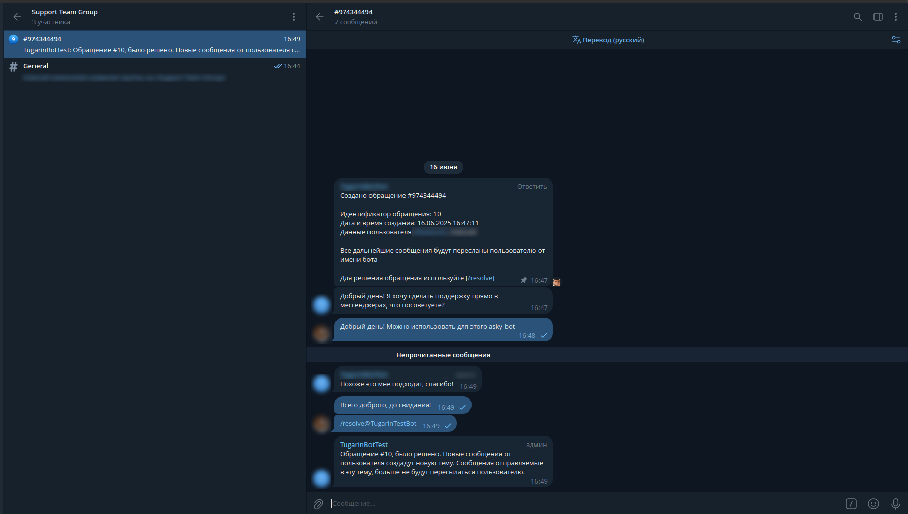

# Asky Bot

Asky Bot - это система обработки заявок пользователей через мессенджеры. Бот позволяет организовать эффективную коммуникацию между пользователями и операторами поддержки.



## Описание

Asky Bot предоставляет следующие возможности:

- Прием сообщений от пользователей и создание заявок
- Маршрутизация заявок в специальные хабы для обработки операторами
- Ответы операторов на обращения пользователей
- Управление статусами заявок (открыта, ожидает ответа, отвечена, решена)
- Поддержка нескольких каналов связи (с возможностью расширения)
- Гибкая настройка ролей пользователей (администратор, оператор, обычный пользователь)

## Архитектура

Система построена на основе модульной архитектуры с использованием следующих технологий:

- **Java** - основной язык программирования
- **Guice** - фреймворк для внедрения зависимостей
- **Hibernate** - ORM для работы с базой данных
- **PostgreSQL** - реляционная база данных для хранения информации сущностей
- **Redis** - хранение состояний и кэширование
- **Docker** - контейнеризация приложения и зависимостей

### Основные компоненты:

- **Channel** - абстракция канала связи (Telegram, и потенциально другие мессенджеры)
- **Hub** - место обработки заявок операторами
- **Ticket** - обращение пользователя
- **Chat** - чат с пользователем
- **Stage** - система управления состояниями обработки сообщений

## Требования

Для запуска Asky Bot требуются:

- Docker и Docker Compose
- Доступ к интернету для работы с API Telegram
- Минимум 1 ГБ оперативной памяти
- 1 ГБ свободного места на диске

Для работы с хабом в телеграмме:

- Для автоматического удаления тем, необходимо разрешение на удаление сообщений и на управление темами
- Для автоматического создания тем, необходимо разрешение на управление темами

## Установка и настройка

### Быстрый старт

1. Скачать и резвернуть последний релиз:
   ```bash
   curl https://github.com/black-hole-team/asky-bot/archive/refs/tags/vx.x.x.zip -o ./asky-bot
   cd asky-bot
   ```

2. Создайте конфигурационный файл:
   ```bash
   cp config/application.conf.sample config/application.conf
   ```

3. Отредактируйте конфигурационный файл `config/application.conf`:
   - Укажите токен Telegram бота в разделе `channels.list.{channel_id}.params.token`
   - Настройте подключение к базе данных в разделе `db`
   - Настройте подключение к Redis в разделе `redis`
   - Настройте роли пользователей в разделе `handling.roles`

4. Запустите приложение с помощью Docker Compose:
   ```bash
   docker-compose up -d
   ```

## Использование

### Для пользователей

1. Пользователь находит бота в Telegram и отправляет ему сообщение
2. Бот создает обращение и перенаправляет сообщение в соответствующий хаб
3. Оператор отвечает на сообщение в хабе
4. Пользователь получает ответ от оператора
5. Диалог продолжается до решения проблемы

### Для операторов

1. Оператор получает доступ к хабу (группе в Telegram)
2. Сообщения пользователей появляются в виде тем в хабе
3. Оператор отвечает на сообщения в соответствующих темах
4. После решения проблемы оператор закрывает обращение командой `/resolve`

## Команды бота

### Для пользователей
- `/start` - начать взаимодействие с ботом, получить приветственное сообщение
- `/help` - получить справку по командам бота

### Для операторов
- `/tickets` - вывести список заявок без фильтра
- `/tickets [Фильтр]` - вывести список обращений по фильтру
- `/select_ticket_{id}` - установить обращение как текущее обрабатываемое обращение для этого чата
- `/continuation` - продлить время до удаления текущей выбранной темы
- `/resolve` - пометить текущее выбранное обращение как решенное
- `/start` - начать взаимодействие с ботом, получить приветственное сообщение
- `/help` - получить справку по командам бота

### Для администраторов
- `/tickets` - вывести список заявок без фильтра
- `/tickets [Фильтр]` - вывести список обращений по фильтру
- `/select_ticket_{id}` - установить обращение как текущее обрабатываемое обращение для этого чата
- `/continuation` - продлить время до удаления текущей выбранной темы
- `/resolve` - пометить текущее выбранное обращение как решенное
- `/register_hub` - зарегистрировать текущий чат или группу как хаб для обработки сообщений
- `/start` - начать взаимодействие с ботом, получить приветственное сообщение
- `/help` - получить справку по командам бота

### Формат фильтра

Команды, поддерживающие фильтрацию, используют гибкую систему фильтрации с специальным синтаксисом:

#### Операторы сравнения:
- `=` - равно
- `!=` - не равно  
- `<` - меньше
- `>` - больше
- `<=` - меньше или равно
- `>=` - больше или равно
- `in {значения}` - содержится в списке
- `not in {значения}` - не содержится в списке

#### Логические операторы:
- `&` - И (AND)
- `|` - ИЛИ (OR)
- `()` - группировка условий

#### Примеры использования:

**Простые фильтры:**
```
/tickets [status = 'OPEN']
/tickets [userId = 12345]
/tickets [createdAt >= '2025-01-01T00:00:00']
```

**Сложные фильтры:**
```
/tickets [status = 'OPEN' & userId = 12345]
/tickets [status in {'OPEN', 'AWAITING_RESPONSE'} | subject = 'Проблема с доступом']
/tickets [createdAt >= '2025-01-01T00:00:00' & (status = 'OPEN' | status = 'ANSWERED')]
```

**Доступные поля для фильтрации обращений (Ticket):**
- `id` - идентификатор обращения (число)
- `subject` - субъект обращения (строка)
- `userId` - идентификатор пользователя (число)
- `status` - статус обращения (OPEN, AWAITING_RESPONSE, ANSWERED, RESOLVED)
- `createdAt` - дата и время создания (формат: 2025-01-01T12:00:00)
- `updatedAt` - дата и время обновления (формат: 2025-01-01T12:00:00)
- `chat.id` - идентификатор чата (число)
- `chat.channelId` - идентификатор канала (строка)
- `chat.channelChatId` - идентификатор чата на стороне канала (строка)
- `chat.bannedAt` - дата и время бана чата (формат: 2025-01-01T12:00:00)

## Конфигурация

Основная конфигурация находится в файле `application.conf`. Основные разделы:

### Webhook
```
webhook {
    port = 443
    base = "/webhook/:name"
}
```

### Каналы связи
```
channels {
    list {
        channel_id {
            type = "telegram_bot"
            webhook_url = "https://asky.black-hole.team/webhook/channel_id"
            use_webhook = false
            params {
                token = "<BOT_TOKEN>"
            }
        }
    }
}
```

### Хабы обработки заявок
```
hub {
    subject_name_pattern = "#${userId}-${channelId}"
}
```

### Обработка сообщений и маршрутизация
```
handling {
    handling_threads_count = -1
    routing {
        channel_id = [
            "channel_id"
        ]
    }
    roles {
        channel_id {
            974344494 = "ADMIN"
            "*" = "COMMON"
        }
    }
}
```

### База данных
```
db {
    url = "jdbc:postgresql://service-postgresql.black-hole.team/asky"
    user = "asky"
    password = "changeit"
    max_pool_size = 50
    batch_size = 100
    driver = "org.postgresql.Driver"
}
```

### Redis
```
redis {
    host = "service-redis.black-hole.team"
    port = 6379
}
```

## Разработка и расширение

### Добавление нового канала связи

Для добавления нового канала связи (например, WhatsApp или VK) необходимо:

1. Создать новую реализацию интерфейса `Channel`
2. Реализовать соответствующие возможности (`ChannelCapability`)
3. Создать фабрику для нового канала
4. Добавить новый тип канала в `ChannelType`
5. Обновить конфигурацию для поддержки нового типа канала

### Расширение функциональности

Система построена на основе обработчиков событий канала (`ChannelEntityHandler`). Для добавления новой функциональности:

1. Создайте новый обработчик событий сущности канала или расширьте существующий
2. Добавьте новые команды с помощью аннотации `@Command`
3. Реализуйте необходимую бизнес-логику

### Хуки (Hooks)

Хуки - это механизм, позволяющий расширять функциональность бота без изменения его исходного кода. Хуки представляют собой JavaScript-файлы, которые выполняются в ответ на определенные события в системе.

#### Типы хуков

В системе поддерживаются следующие типы хуков:

- **MESSAGE** - срабатывает при получении нового сообщения
- **HUB_CREATE** - срабатывает при создании нового хаба
- **TICKET_CREATE** - срабатывает при создании нового обращения

#### Структура директории хуков

Хуки размещаются в директории `hooks` в корне проекта, в поддиректориях, соответствующих типу хука:

```
hooks/
├── message/
│   ├── on_message_receive.js
│   └── ...
├── hub_create/
│   ├── on_hub_create.js
│   └── ...
├── ticket_create/
    ├── on_ticket_create.js
    └── ...
```

#### Создание хука

Для создания хука необходимо:

1. Создать JavaScript-файл в соответствующей поддиректории
2. Реализовать функцию `handle(event)`, которая будет вызываться при наступлении события

Пример хука для обработки сообщений (`hooks/message/on_message_receive.js`):

```javascript
/**
 * Обрабатывает получение нового сообщения
 * @param event событие получения нового сообщения
 */
function handle(event) {
    // Выводим событие получения сообщения в лог
    logger.info("Получено новое сообщение: " + event.getMessage().content());
    
    // Доступ к пулу каналов
    var channel = pool.getChannelById(event.getMessage().channelId());
    
    // Дополнительная логика обработки сообщения
    // ...
}
```

#### Доступные объекты в контексте хука

В контексте выполнения хука доступны следующие объекты:

- **logger** - объект для логирования (Log4j2)
- **pool** - пул каналов (ChannelPool)
- **event** - объект события, соответствующий типу хука

#### Использование хуков

Хуки могут использоваться для:

- Интеграции с внешними системами
- Расширенной обработки сообщений
- Отправки уведомлений
- Сбора статистики
- Модификации поведения бота без изменения исходного кода

## TODO

- Запрос данных из конфигурации (ФИО, Дата рождения) при каждом новом здании чата

## Лицензия

Этот проект распространяется под лицензией [PolyForm-Noncommercial-1.0.0](LICENSE).
Коммерческое использование запрещено без явного согласия автора.

## Разработчики

- Aleksey Plekhanov (@AseWhy) - astecoms@gmail.com
